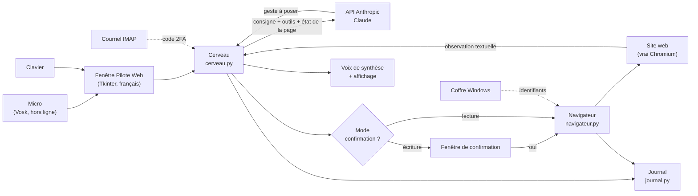

# Plan de construction

Document technique : ce qui a été construit, pourquoi ces choix, et ce qui
reste à décider. Il répond point par point à la section 9 du document de
contexte.

---

## 1. État de la livraison

| Exigence du contexte | État | Où c'est fait |
|---|---|---|
| Vraie application Windows, pas un site web | ✅ | fenêtre Tkinter, `pilote/interface.py`, lancée par `lancer.bat` |
| Pilotage d'un navigateur, sans API | ✅ | `pilote/navigateur.py` (Playwright + Chromium) |
| Cerveau = Claude, API Anthropic | ✅ | `pilote/cerveau.py` |
| Commande vocale | ✅ | `pilote/voix.py` (Vosk, hors ligne) — repli clavier si absent |
| Réponse à voix haute **et** à l'écran | ✅ | `pilote/voix.py` (voix Windows) + zone de conversation |
| Interface en français | ✅ | toute l'application, y compris les messages d'erreur |
| Lire des dossiers, extraire des rapports | ✅ | outils `observer_page`, `lire_texte` |
| Entrer des données, créer des fiches, remplir des formulaires | ✅ | outils `ecrire`, `choisir`, `cocher`, `cliquer` |
| Connexion autonome avec identifiants enregistrés | ✅ | coffre Windows + outil `saisir_identifiant` |
| Travail dans une session déjà ouverte | ✅ | mode `session_ouverte` + `demarrer_chrome_partage.bat` |
| Aucune liste fermée de sites | ✅ | socle générique ; profils facultatifs par-dessus |
| Code 2FA récupéré seul dans le courriel | ✅ | `pilote/courriel.py` (IMAP) ; repli : demande à l'utilisateur |
| Interrupteur autonome / confirmation | ✅ | case à cocher en haut de la fenêtre, `pilote/outils.py` |
| Journal de toutes les actions | ✅ | `pilote/journal.py`, onglet Journal |
| Réessais puis alerte | ✅ | `Navigateur._reessayer` : 3 tentatives (2 s, 4 s, 8 s) puis alerte vocale |
| Lancement manuel, pas de démarrage automatique | ✅ | rien n'est inscrit au démarrage de Windows, aucun service |
| Un seul utilisateur | ✅ | aucune gestion de comptes |
| Budget le plus bas possible | ⚠️ | tout est gratuit sauf l'API ; voir [COUTS.md](COUTS.md) et le risque n° 1 |
| Conformité aux conditions d'utilisation | ❌ non vérifiable | voir le risque n° 2 |

---

## 2. Pile technique et justification

| Besoin | Choix | Pourquoi celui-là |
|---|---|---|
| Langage | **Python 3.12** | gratuit, installable depuis le Microsoft Store en deux clics, SDK Anthropic officiel, écosystème complet pour la voix et le navigateur |
| Pilotage du navigateur | **Playwright** (Chromium) | gratuit, robuste sur les sites modernes, gère les iframes et l'attente des chargements, profil persistant intégré (les sessions restent ouvertes), peut se brancher sur un Chrome déjà lancé |
| Interface | **Tkinter** | livré avec Python : aucune dépendance, aucun installateur, démarrage instantané |
| Reconnaissance vocale | **Vosk** (modèle français) | gratuit, hors ligne, la voix ne quitte pas l'ordinateur, ~40 Mo |
| Synthèse vocale | **pyttsx3** → voix SAPI5 de Windows | gratuit, hors ligne, déjà installé avec Windows |
| Mots de passe | **keyring** → Gestionnaire d'identification de Windows | chiffré par Windows, lié à la session ; aucun fichier de mots de passe |
| Codes 2FA | **IMAP** (`imaplib`, bibliothèque standard) | protocole universel : Gmail, Microsoft 365, iCloud, hébergeurs d'entreprise, sans dépendre d'une API propriétaire |
| Journal | **JSONL + texte** | lisible à l'œil nu, exploitable par un tableur, sans base de données |

### Ce qui a été écarté, et pourquoi

- **Electron / Node.js** — application 150 Mo, deux écosystèmes à installer,
  aucun gain ici.
- **C# / WinForms + Selenium** — Visual Studio à installer, compilation à chaque
  correction : inadapté à un utilisateur qui construit avec Claude Code.
- **Le pilotage par capture d'écran (« computer use »)** — Claude regarde des
  images de l'écran. Impressionnant, mais chaque étape coûte 10 à 20 fois plus
  cher et l'exigence « le moins cher possible » l'exclut. L'application utilise
  une lecture **textuelle** de la page et ne prend une image qu'en dernier
  recours.
- **Un outil RPA du commerce (UiPath, Power Automate)** — licence mensuelle, et
  ne raisonne pas : il faut redessiner le scénario à chaque changement de site.

---

## 3. Architecture

### La boucle, en clair

1. Vous dictez ou tapez une consigne.
2. Le cerveau l'envoie à Claude avec la liste des outils et l'état de la page.
3. Claude répond par **un** geste (« clique sur *Nouveau dossier* »).
4. Le mode de confirmation s'applique si le geste écrit quelque chose.
5. Le geste est posé dans le navigateur ; la nouvelle page est observée.
6. Retour à l'étape 2, jusqu'à ce que Claude annonce la tâche terminée.
7. Le compte rendu est lu à voix haute et affiché.

Chaque étape est inscrite au journal. Deux plafonds encadrent la boucle : le
coût et le nombre d'étapes.

### Les fichiers

| Fichier | Rôle |
|---|---|
| `pilote/interface.py` | la fenêtre, les onglets, le fil de travail |
| `pilote/cerveau.py` | la boucle avec Claude, le calcul du coût, les plafonds |
| `pilote/outils.py` | les 14 outils offerts à Claude, la règle lecture / écriture |
| `pilote/navigateur.py` | l'observation des pages et les gestes, les réessais |
| `pilote/voix.py` | dictée et lecture à voix haute |
| `pilote/courriel.py` | récupération du code 2FA par IMAP |
| `pilote/secrets_win.py` | coffre de Windows |
| `pilote/journal.py` | journal des actions |
| `pilote/config.py` | réglages et profils de sites |
| `tests/` | vérifications sans API ni navigateur |

### Comment Claude « voit » la page

Pas d'images : à chaque observation, l'application dresse la liste des éléments
utilisables (avec une étiquette du type `c0e12`), le titre, l'adresse et le
texte visible, plafonné à 3 000 caractères. Les iframes sont couverts — beaucoup
de CRM y logent leurs formulaires. Claude ne manipule que ces étiquettes, ce qui
évite les sélecteurs fragiles et les clics à l'aveugle.

---

## 4. Sessions et identifiants

**Deux modes de session, tous deux livrés :**

- `profil_dedie` (par défaut) — l'application ouvre son propre Chromium avec un
  profil permanent. Vous vous connectez une fois ; les sessions restent
  ouvertes d'un lancement à l'autre, comme dans un navigateur ordinaire.
- `session_ouverte` — l'application se branche sur le Chrome que vous avez
  ouvert avec `demarrer_chrome_partage.bat` et travaille dans **vos** onglets,
  avec vos connexions en cours.

**Les identifiants** sont enregistrés dans le Gestionnaire d'identification de
Windows (chiffré, lié à votre session Windows). Trois garanties :

1. aucun mot de passe dans un fichier de l'application ;
2. aucun mot de passe envoyé à Claude — l'outil `saisir_identifiant` va le
   chercher dans le coffre et l'écrit directement dans le champ de la page ;
3. aucun mot de passe dans le journal.

---

## 5. Codes 2FA par courriel

L'outil `obtenir_code_2fa` se connecte en IMAP, lit les courriels des dernières
minutes, filtre sur l'expéditeur attendu, extrait le code par motif
(`\b(\d{6})\b` par défaut, réglable par site), et le rend à Claude qui le saisit.

Le connecteur attend l'arrivée du courriel (jusqu'à 120 secondes par défaut) :
le code n'est presque jamais là au moment où la page le demande.

**Repli obligatoire** : si IMAP est désactivé par l'organisation, si le mot de
passe d'application est refusé, ou si rien n'arrive, l'application **demande le
code à voix haute** et vous le dictez ou le tapez. La tâche continue. C'est
volontaire : le 2FA est le point le plus fragile de la chaîne, il ne doit jamais
être un cul-de-sac.

> Fournisseur non encore choisi (information manquante n° 3). L'implémentation
> IMAP couvre Gmail, Microsoft 365 et la plupart des hébergeurs sans
> modification ; seuls les réglages changent.

---

## 6. L'interrupteur des deux modes

La case **« Demande-moi avant d'agir »**, en haut de la fenêtre, bascule entre :

| Mode | Comportement |
|---|---|
| **Autonome** (décochée) | l'application agit directement |
| **Confirmation** (cochée, par défaut) | une fenêtre demande votre accord avant chaque écriture |

### Ce qui compte comme une « écriture »

Chaque outil porte une nature :

- **lecture** — naviguer, observer, lire, défiler, attendre : jamais confirmé ;
- **saisie** — remplir un champ, cocher, choisir : rien n'est encore enregistré
  dans le site, donc pas de confirmation par défaut ;
- **écriture** — tout geste qui enregistre, soumet, crée, modifie ou supprime :
  confirmé.

Un clic est une écriture si Claude le déclare, **ou** si le libellé du bouton le
trahit (`Enregistrer`, `Soumettre`, `Créer`, `Supprimer`, `Envoyer`, `Payer`,
`Save`, `Submit`, `Delete`…), **ou** si c'est la touche Entrée dans un
formulaire. Ce filet double la déclaration de Claude : même si le modèle se
trompe, un clic sur « Supprimer » demande votre accord.

Pour confirmer aussi les saisies de champs, ajoutez `"confirmer_saisies": true`
dans `config.json`.

Un refus n'est pas un échec : l'application l'inscrit au journal et demande à
Claude de proposer autre chose.

---

## 7. Journal des actions

`%APPDATA%\PiloteWeb\journal\`, un fichier par jour, en double format :
`.txt` (lisible) et `.jsonl` (exploitable dans un tableur).

Y sont inscrits : les consignes reçues, chaque geste avec son site et son heure,
les consultations, les refus, les échecs et réessais, les changements de mode,
les codes 2FA récupérés (sans le code), les coûts par tâche.
**N'y sont jamais inscrits** : les mots de passe, la clé d'API.

Conservation : **90 jours** par défaut (réglable ; à confirmer — information
manquante n° 7). La purge est automatique au démarrage.

---

## 8. Réessais et alerte

| Paramètre | Valeur livrée | Réglable |
|---|---|---|
| Tentatives par geste | 3 | oui |
| Délais entre tentatives | 2 s, 4 s, 8 s | oui |
| Après échec | alerte vocale + message à l'écran + journal | — |
| Étapes maximum par tâche | 40 | oui |
| Plafond de coût par tâche | 0,75 $ US | oui |

Trois niveaux de rattrapage :

1. **le geste** — réessayé trois fois avec attente croissante (page lente,
   élément pas encore affiché) ;
2. **le raisonnement** — l'échec est renvoyé à Claude, qui change de stratégie
   plutôt que de répéter ;
3. **vous** — après trois échecs sur le même point, l'application vous explique
   le blocage et demande quoi faire.

> Ces valeurs sont des choix provisoires (information manquante n° 5).

---

## 9. Estimation de coût

Résumé — le détail, les hypothèses et les leviers sont dans [COUTS.md](COUTS.md).

| Tâche | Claude Opus 5 | Claude Sonnet 5 |
|---|---|---|
| Consultation courte (5 étapes) | ~0,10 $ US | ~0,04 $ |
| Connexion + 2FA + consultation (12 étapes) | ~0,40 $ | ~0,16 $ |
| Création de fiche (20 étapes) | ~0,95 $ | ~0,38 $ |
| **Usage soutenu** (15 tâches/jour, 21 jours) | **~130 $/mois** | **~50 $/mois** |

Économies déjà intégrées : mise en cache du préfixe (les consignes et les outils
ne sont facturés plein tarif qu'une fois), allègement automatique de
l'historique, lecture textuelle des pages plutôt que par images, effort de
raisonnement à `medium`, plafond par tâche.

---

## 10. Les trois risques, assumés

### Risque 1 — Le coût n'est pas nul

Confirmé, chiffré ci-dessus. « Le moins cher possible » et « Claude comme
cerveau » ne se rejoignent pas à zéro. Le budget minimal réaliste pour un usage
professionnel quotidien se situe entre **25 $ et 130 $ US par mois** selon le
modèle choisi. Fixez une limite de dépense dans la console Anthropic : c'est le
seul plafond qu'aucun bogue ne peut franchir.

### Risque 2 — Conformité aux conditions d'utilisation : non vérifié

Automatiser une connexion et le passage d'un 2FA **peut contrevenir aux
conditions d'utilisation** du site visité. Aucun CRM précis n'ayant été nommé,
la question n'a pas pu être tranchée. À vérifier auprès de chaque fournisseur
avant la mise en production, en particulier : automatisation autorisée ?
partage de session autorisé ? lecture programmatique des codes 2FA autorisée ?
Le point est signalé, il n'est pas réglé par le code.

### Risque 3 — « N'importe quel site » réduit la fiabilité

Traité par la construction à deux étages : un socle générique qui fonctionne
partout, et des **profils de sites** pour les sites prioritaires
([PROFILS.md](PROFILS.md)). Le modèle de profil livré (`pilote/profils/exemple_crm.json`)
attend d'être rempli — **les sites prioritaires restent à nommer** (informations
manquantes n° 1 et n° 2). Tant qu'aucun profil n'existe, l'application marche,
mais tâtonne davantage : plus d'étapes, donc plus cher, et plus de risques de
gestes inexacts.

---

## 11. Les sept informations manquantes

Chacune a reçu une valeur provisoire pour que l'application soit utilisable
aujourd'hui. Aucune n'est figée.

| # | Information | Valeur provisoire retenue | Où la changer |
|---|---|---|---|
| 1 | CRM prioritaire | aucun — modèle de profil vide fourni | `%APPDATA%\PiloteWeb\profils\` |
| 2 | Autres sites prioritaires | aucun | idem |
| 3 | Fournisseur de courriel et connecteur 2FA | IMAP générique, préréglé pour Gmail | onglet Réglages |
| 4 | Budget mensuel de l'API | non fixé ; plafond de 0,75 $ par tâche | onglet Réglages + console Anthropic |
| 5 | Réessais et délais | 3 tentatives : 2 s, 4 s, 8 s | onglet Réglages / `config.json` |
| 6 | Stockage des identifiants | Gestionnaire d'identification de Windows | choix structurant — voir ci-dessous |
| 7 | Conservation du journal | 90 jours | onglet Réglages |

Le point 6 est le seul qui ne se change pas d'un clic : le coffre de Windows a
été retenu parce qu'il est chiffré, gratuit, déjà présent, et qu'il évite tout
fichier de mots de passe. Si un gestionnaire d'entreprise (1Password, Bitwarden,
LastPass) doit être utilisé à la place, c'est `pilote/secrets_win.py` qu'il faut
remplacer — le reste de l'application n'y touche pas.

---

## 12. La suite

Par ordre d'utilité, une fois les informations manquantes recueillies :

1. **Écrire le profil du CRM** dès qu'il est nommé — c'est le plus gros gain de
   fiabilité et de coût disponible.
2. **Vérifier les conditions d'utilisation** du CRM et des portails visés
   (risque n° 2), avant tout usage en production.
3. **Rejouer le scénario d'acceptation** de la version 1 (étape 9 de
   [INSTALLATION.md](INSTALLATION.md)) sur le vrai CRM, en mode confirmation.
4. **Ajuster le modèle** : commencer sur Opus 5, passer les tâches rodées sur
   Sonnet 5 et comparer les résultats sur une semaine.
5. **Mesurer**, avec le journal : nombre d'étapes par tâche, taux d'échec, coût
   réel. Ce sont ces chiffres, et non une estimation, qui diront quoi optimiser.

### Idées pour une version 1.1

- Enregistrer une tâche réussie comme **routine** rejouable sans repasser par
  Claude à chaque étape (grosse économie sur les tâches répétitives).
- Un bouton **« reprendre là où ça a bloqué »** après une alerte.
- Un **résumé hebdomadaire** du journal : tâches, temps, coûts.
- L'**extraction vers Excel** en un geste pour les rapports.
